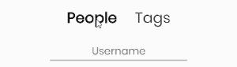
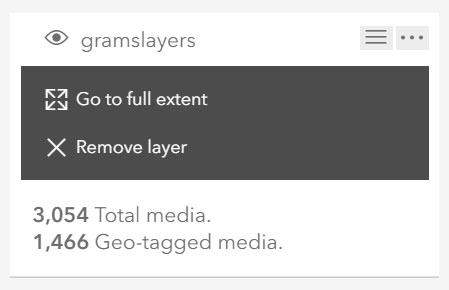

<h1 align="center">
     
    GramIS: Instagram Photo Mapper
</h1>

## Table of Contents

- [Application Demo](#application-demo)
- [Requirements](#requirements)
- [Features](#features)
- [Usage](#usage)

## Application Demo

      
    <a href="http://www.josejuansandoval.com/projects/GramIS/"><strong>Click here to go to the GramIS Live Demo</strong></a>

## Requirements

* This application requires the use of Instagram's private API created by @mgp25 which is not included in this repository. If you want to run it locally or on your own server download the API from [here](https://github.com/mgp25/Instagram-API).
* This application also requires ESRI's ArcGIS JavaScript API. For more information about it click [here](https://developers.arcgis.com/javascript/).

## Features

* Search for photos from users or hashtags. 
   
* View a photo's details in the popup box.
  * User's profile picture (Click it to open the user's page in Instagram.com)
  * Username
  * Location
  * Picture (Click it to open it lightbox mode)
  * Likes
  * Caption
  * Upload date 
   
* View search term details in the layer list. Each search is placed on a different layer.
  * Number of total media uploaded by the user or containing the hashtag.
  * Number of geo-tagged media acquired so far.
  * Actions
    * Toggle layer visibility.
    * Zoom in or out to the layer's full extent.
    * Remove layer. 
   

## Usage

**NOTE: GramIS can only retrieve publicly available geottaged photos.**

1. Start a search by either entering an Instagram username or a hashtag and press Enter on your keyboard.
2. GramIS will then check if the content of the user or hashtag is available. If the content is available, GramIS will start mapping the photos by using their geotags.
3. Click on an Instagram icon on the map to view the photo and its details in a popup box.
